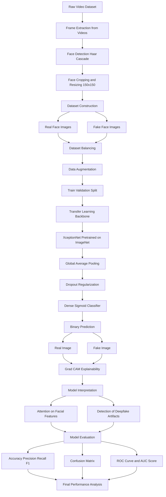

# FaceGuard: Deepfake Detection using XceptionNet and GradCAM

An explainable deepfake detection system using a fine-tuned **XceptionNet convolutional neural network** with **Grad-CAM visualization** and full **quantitative evaluation metrics**.

---

## Project Overview

Deepfakes are AI-generated manipulated videos or images that can spread misinformation and threaten digital trust. This project develops a **deep learning based deepfake detection system** that classifies facial images as **Real** or **Fake** while also explaining model decisions using **Grad-CAM heatmaps**. The system uses **transfer learning with XceptionNet**, trained on extracted face frames from manipulated and authentic videos.

### Dataset

The model is trained and evaluated using the **FaceForensics++ Dataset (C23 compression level)**, a widely used benchmark dataset for deepfake detection research.

- **Original Dataset Source:**  
  https://github.com/ondyari/FaceForensics

- **Official Dataset Paper:**  
  https://arxiv.org/abs/1901.08971

- **Kaggle Version Used in This Project:**  
  https://www.kaggle.com/datasets/xdxd003/ff-c23

The dataset contains both **real videos and manipulated videos** created using multiple deepfake generation methods. In this project, frames are extracted from the videos, faces are detected using **OpenCV Haar Cascade**, and cropped facial images are used to train the **XceptionNet-based deepfake classifier**.

---

## Model Architecture Pipeline

The project uses **XceptionNet (Extreme Inception)** as the backbone CNN.

## Training Configuration

| Parameter | Value |
|---|---|
| Backbone Model | XceptionNet (ImageNet Pretrained) |
| Input Size | 150 × 150 × 3 |
| Batch Size | 32 |
| Optimizer | Adam |
| Learning Rate | 0.0001 |
| Loss Function | Binary Crossentropy |
| Epochs | 15 (EarlyStopping applied) |
| Regularization | Dropout |
| Data Augmentation | Horizontal Flip, Brightness Adjustment |
| Callbacks | EarlyStopping, ModelCheckpoint |

---

## Model Performance

### Training Progress

The model was trained using **transfer learning with XceptionNet**, where the top layers were fine-tuned for deepfake detection.

Training Accuracy ≈ **92%**  
Validation Accuracy ≈ **80%**

Early stopping was used to prevent overfitting and restore the best model weights.

---

## Evaluation Metrics

The model was evaluated using multiple metrics including **Precision, Recall, F1-score, Accuracy, and ROC-AUC**.

### Classification Report

| Class | Precision | Recall | F1-score | Support |
|---|---|---|---|---|
| Fake | 0.882 | 0.682 | 0.769 | 198 |
| Real | 0.742 | 0.910 | 0.817 | 199 |
| Accuracy | 0.796 | 0.796 | 0.796 | 397 |

**Overall Accuracy:** 0.7960

---

## ROC-AUC Performance

ROC-AUC Score: **0.9038**

An ROC-AUC score above **0.90** indicates strong separability between **real and fake images**.

---

## Confusion Matrix

|               | Predicted Fake | Predicted Real |
|---------------|---------------|---------------|
| **True Fake** | 134           | 64            |
| **True Real** | 19            | 180           |

This shows that the model correctly identifies most **real and fake samples**, though some fake images are predicted as real due to subtle manipulation artifacts.

---

## Explainability with Grad-CAM

To improve transparency, **Grad-CAM visualization** was applied to highlight regions influencing the model’s predictions.

Typical observations:

- **Real images:** attention focuses on natural facial textures and structures  
- **Fake images:** heatmaps highlight manipulation artifacts and inconsistencies  

Grad-CAM helps interpret **why the model classifies an image as real or fake**, making the system more explainable.

---

## Key Features

- Deepfake detection using **CNN transfer learning**
- **XceptionNet backbone architecture**
- Automated **frame extraction and face detection**
- **Data augmentation for robust training**
- **Grad-CAM explainability**
- Comprehensive evaluation using:
  - Accuracy
  - Precision
  - Recall
  - F1-score
  - ROC-AUC
  - Confusion Matrix

---

## Limitations

- Dataset size is relatively small compared to large research benchmarks
- Only a limited number of frames extracted per video
- Performance could improve with larger datasets and additional deepfake techniques

---

## Future Improvements

- Train on larger datasets
- Extract multiple frames per video to increase dataset diversity
- Experiment with **Vision Transformers (ViT)** or **EfficientNet**
- Improve face detection using **MTCNN or RetinaFace**
- Deploy the model for **real-time deepfake detection**

---

## Disclaimer

This project is developed for **academic and research purposes only** as part of a deep learning course project. The model is trained on the **FaceForensics++ dataset**, which is intended for research on manipulated media detection. I have used the Kaggle version. 

The system is **not intended for production or legal use** and may produce incorrect predictions in real-world scenarios.  
All dataset rights belong to the original authors of **FaceForensics++**.

Users are responsible for ensuring that the dataset and code are used in accordance with the **dataset license and research guidelines**.

---

## Author

**Ummay Maimona Chaman**  
Undergraduate Student – Computer Science & Engineering at BRAC University
Deep Learning Project : Deepfake Detection using **XceptionNet and Grad-CAM**

GitHub: [https://github.com/yourusername](https://github.com/UmmayMaimonaChaman)
⭐ If you find this project useful, please consider starring the repository. Also, let me know for any suggestions :)
